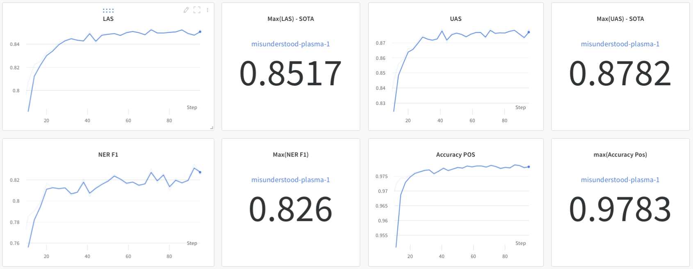

# Making State-of-the-art for Danish NLP 

A couple of days ago it came to my attention that SpaCy released its new [version 3](https://SpaCy.io/usage/v3) of its very popular natural language processing software. I have only had little experience with the software but the it have always been positive. The team is friendly and SpaCy is fast and efficient, not only the pipeline, but the response time on an issue is nothing to complain about. Having a read through the new features I quickly wrote my prediction to a friend, "SpaCy v. 3 will do more for Danish NLP that any other product". Why did I think that? First of all SpaCy is production friendly and, Secondly, version 3 integrated not only with Huggingface's Transformers, but with a variety of other deep learning and software frameworks such as Tensorflow, Pytorch, Streamlit, Weights and Biases and their own tagging software Prodigy. It thus provides a great tool for pulling from all of these great resources. There is some additional great stuff, such as Projects, which makes for convenient and reproducible pipeline training, but I will not get too much into that. Let's get to the Juicy part.

## Testing
SpaCy has made it fairly easy to train new models, I simply followed their [quickstart](https://SpaCy.io/usage/training#quickstart) started a project, downloaded the dataset DaNE using the [DaNLP](https://github.com/alexandrainst/danlp) package provided by the Alexandra institute. This dataset include all (as far as the author is aware) of the Danish benchmark for which there exist a consistently used dataset. These tasks include Part-of-speech tagging (POS), e.g. tagging a words is an adjective, Named-entity recognition (NER), recognition that "Mette" is a name, and Dependency parsing, e.g. extracting that the adjective describes the name and another thing.


<details>
  <summary>What about Sentiment Analysis?</summary>

---

Sentiment analysis, denoting whether a sentence is positive or negative, is a task I have been thinking about adding it to the pipeline, but sentiment analysis as a task is often crudely defined and multiple different datasets exist for Danish. On DaNLP's github currently there exist no less than three main types of models. One predicts sentiment as "positive", "negative", or "neutral". Another predict the degree to which the text is positive or negative on a scale. A third predicts emotions and the last one predicts whether the text is subjective or objective.

---

</details> 


So after tweaking around a bit as you usually do, changing a toggle here and there, researching some option and finally moving the whole thing to a GPU server. I set it to train and waited around an hour, this is what we got.

```{r, echo=F, message=F}
library(tidyverse)
library(kableExtra)
library(knitr)
perf = tribble(
  ~"Framework",           ~Accuracy, ~"Location", ~"Organization", ~"Person", ~"Avg F1" , ~UAS, ~LAS,
  "BERT",           NA,        83.90,      72.98,       92.82,       84.04,       NA,      NA,
  "Flair",          97.97,     84.82,      62.95,       93.15,       81.78,       NA,      NA, 
  "SpaCy (v2)",     96.15,     75.96,      59.57,       87.87,       75.73,       81.36,   77.46,
  "Stanza",         97.75,     NA,         NA,          NA,          NA,          86.83,   84.19,
  "Polyglot",       NA,        64.95,      39.3,        78.74,       64.18,       NA,      NA,
  "NERDA (mBERT)",  NA,        80.75,      65.73,       92.66,       80.66,       NA,      NA,
  "DaCy medium (in-development)",   97.83,     87.37,      69.88,       91.84,       82.6,        87.82,   85.17
)

columns = colnames(perf)[2:length(colnames(perf))]

highlight_highest = function(kable_input, dataset, columns, underline_second=T){
  for (col in columns){
    idx = which(colnames(dataset) == col)
    highest = if_else(dataset[[col]] == max(dataset[[col]], na.rm=T), T, F, missing=F)
    
    if (underline_second){
      sorted = sort(dataset[[col]])
      second_highest = sorted[length(sorted)-1]
      second = if_else(dataset[[col]] == second_highest, T, F, missing=F)
      kable_input = column_spec(kable_input, idx, bold = highest, underline = second)      
    } else{
      kable_input = column_spec(kable_input, idx, bold = highest)
    }
    }
  return(kable_input)
}


options(knitr.kable.NA = '')
cap = "Highest scores are in bold and second highest is underscored. No values indicate that the framwork does not have trained model"
# add note that these were on the test set  ()
perf %>%  
  kbl(., 
      align=c("l", rep("c", length(columns)))) %>%
  add_header_above(c(" " = 1, "POS" = 1, "NER"= 4, "Dependency Parsing" = 2)) %>% 
  highlight_highest(., perf, columns = columns) %>% 
  kable_material(c("hover", "condensed")) %>% 
  row_spec(7, bold = F, italic = F, background="beige")
```

<details>
  <summary>What does these numbers mean?</summary>

---

  So for the user less familiar with NLP this is a short description of the measurements presented here. Naturally higher is better and the Accuracy is just what you expect. The percentage correct out of all possible options. The F1-score, is the balanced precision and recall. This is the classic score estimate the performance of NER. Why not accuracy? Well since most words in a sentence is not a named entity you can end with a great accuracy simply by predicting all words as not being a named entity. For more on the F1-score check out this [blog post](https://machinelearningmastery.com/classification-accuracy-is-not-enough-more-performance-measures-you-can-use/). Lastly, UAS is the proportion of tokens whose head has been correctly assigned and LAS is the proportion of tokens whose head has been correctly assigned with the right dependency label. Don't know what this mean? It is also a bit extensive to go too much into here, but the measurements are typically used for evaluating dependency parsing.

<div class="alert alert-info">
  Note that the average F1 also include other categories that the ones shown in the table e.g. the miscellaneous.
</div>

---

</details> 

State-of-the-art (SOTA) on Dependency Parsing and close to SOTA in Named Entity Recognition (NER) and Part-of-Speech Tagging (POS). Not only that this models do all task *AT ONCE* while the other models only do one task at a time. This makes it much faster and much more production friendly. For a quick comparison on our hardware the Danish BERT takes ~8.000 words/s, so doing all three tasks independently would reduce the speed to $8.000/3 \approx 2500$ words/s if not more if you include overhead. So model is not only competitive, but competitive with a handicap.

<details>
  <summary>But Doesn't Multitask learning increase performance?</summary>

---

The judge is still out on this. With multiple papers pointing in different direction. E.g. the [T5 paper](https://arxiv.org/abs/2101.11038) by Google indicates that it hurts slightly (excluding task specific fine-tuning) while the [Muppet paper](https://arxiv.org/abs/2101.11038) argues that you need at least 15 or more tasks for it to improve the model performance. This is, however during fine-tuning and with more data than is available for Danish.

---

</details> 

```{r pressure, echo=FALSE, fig.cap="The perfomances I saw when I logged into Weight and Biases after training. Note these number are on the development set, not the test set. We will get to that", out.width = '100%'}

```


## Version 2
So as we saw the previous model had a few things going for it, but there was a few thing to change. The previous model used the Danish Transformer by BotXO version 1, but they released a version 2, which have been kindly uploaded to Huggingface's Model Library by Malte Bertelsen. So changing that out was easy. I changed a few other thing, mainly increased batch size and the number of training steps. For those who want all the gory details feel free to check out the commit change to the config file on the associated [Github](https://github.com/KennethEnevoldsen/Training_Danish_SpaCy). What did we get out of this? Well for once we got SOTA performance in NER and POS as well and while maintaining SOTA in Dependency Parsing.

```{r, echo=F, message=F}
perf = tribble(
  ~"Model",           ~Accuracy, ~"Location", ~"Organization", ~"Person", ~"Avg F1" , ~UAS, ~LAS,
  "DaCy medium (DaBERT v1)",   97.83,     87.37,      69.88,       91.84,       82.6,        87.82,   85.17,
  "DaCy medium (DaBERT v2)",   98.00,     88.5,      72.83,       91.45,       84.36,        87.4,   84.9
)

columns = colnames(perf)[2:length(colnames(perf))]


options(knitr.kable.NA = '')
cap = "Highest scores are in bold."
# add note that these were on the test set  ()
perf %>%  
  kbl(., 
      align=c("l", rep("c", length(columns)))) %>%
  add_header_above(c(" " = 1, "POS" = 1, "NER"= 4, "Dependency Parsing" = 2)) %>% 
  highlight_highest(., perf, columns = columns, underline_second = F) %>% 
  kable_material(c("hover", "condensed"))
```
 

## Scaling
Yes this is another lesson in *"bigger is better"*-lesson, but it is also a lesson to in the efficiency of multilingual models, which are typically very competitive to the point were you might question whether you need a monolingual model.

So wanting to scale up and with a lack of bigger Danish models I took the first big (and robustly trained) multilingual model I could find on Huggingface's model library and applied it. Same workflow, slightly bigger batch size, simply changed the model name to `"xlm-roberta-large"`. I also took the time to actually do the evaluate both models so these scores are actually from the test set of DaNE as opposed to just the development set. Most notably there is quite the drop in Named entity performance for DaCy (medium) using DaBERT.

```{r, echo=F, message=F}
perf = tribble(
  ~"Model",           ~Accuracy, ~"Location", ~"Organization", ~"Person", ~"Avg F1" , ~UAS, ~LAS,
  "BERT",           NA,        83.90,      72.98,       92.82,       84.04,       NA,      NA,
  "Flair",          97.97,     84.82,      62.95,       93.15,       81.78,       NA,      NA, 
  "SpaCy (v2)",     96.15,     75.96,      59.57,       87.87,       75.73,       81.36,   77.46,
  "Stanza",         97.75,     NA,         NA,          NA,          NA,          86.83,   84.19,
  "Polyglot",       NA,        64.95,      39.3,        78.74,       64.18,       NA,      NA,
  "NERDA (mBERT)",  NA,        80.75,      65.73,       92.66,       80.66,       NA,      NA,
  "Dacy medium (DaBERT v2)",   97.93,     83.09,      67.35,       89.62,                78.47,        87.88,   85.34,
  "DaCy large (XLM Roberta)",   98.39,     83.90,      77.82,       95.53,       85.20,        90.59,   88.34
)

columns = colnames(perf)[2:length(colnames(perf))]


options(knitr.kable.NA = '')
cap = "Highest scores are in bold. This table is using the test set so scores is slightly different."
# add note that these were on the test set  ()
perf %>%  
  kbl(., 
      align=c("l", rep("c", length(columns)))) %>%
  add_header_above(c(" " = 1, "POS" = 1, "NER"= 4, "Dependency Parsing" = 2)) %>% 
  highlight_highest(., perf, columns = columns, underline_second = T) %>% 
  kable_material(c("hover", "condensed")) %>%
    row_spec(7:8, bold = F, italic = F, background="beige")
```

As already spoiled, the DaCy large outperforms the competition on all tasks! However it is bigger and thus slower. On our Quadro RTX 8000 GPU's the DaCy medium takes 8335 words/s while DaCy large takes 4311 words/s. So depending on how crucial those few percent are one might choose one over the other. On that note the SpaCy v2 model, which uses word embedding and a CNN, takes about 10.000 words/s on a CPU ^[This is as reported by SpaCy, but all of this is likely to change depending on hardware.], so if one is looking for speed it is by quite the margin the fastest model.

## Giving back
What is next? Well I will reach out to DaNLP and SpaCy to have both versions of DaCy made available. This should allow companies and research teams to easily use these in their research. If you want them before that feel free reach out to me on any of my social profiles. I might also dabble a bit with integrating a text classification model, e.g. sentiment into the pipelines, but that will be the next version. The models will be available under an open source license.

If you want to reproduce the models feel free examine the Github. It used the new SpaCy projects so everything should be completely reproducible. Note that a specific branch is made for the Roberta model.

### Acknowledgements
This is really a whole blog on acknowledgment of great open source software and contributors to it but just to make it clear. This wouldn't have been possible with the work by the SpaCy team which developed an integrated the software. Huggingface for developing Transformers and making model sharing convenient. BotXO for training and sharing the Danish BERT model and Malte Højmark-Bertelsen for making it easily available. DaNLP have made it extremely easy to get access to Danish resources to train on and even supplied some of the tagged data themselves and does a great job of actually developing these datasets.

<!-- begin wwww.htmlcommentbox.com -->
 <div id="HCB_comment_box"><a href="http://www.htmlcommentbox.com">Comment Form</a> is loading comments...</div>
 <link rel="stylesheet" type="text/css" href="https://www.htmlcommentbox.com/static/skins/bootstrap/twitter-bootstrap.css?v=0" />
 <script type="text/javascript" id="hcb"> /*<!--*/ if(!window.hcb_user){hcb_user={};} (function(){var s=document.createElement("script"), l=hcb_user.PAGE || (""+window.location).replace(/'/g,"%27"), h="https://www.htmlcommentbox.com";s.setAttribute("type","text/javascript");s.setAttribute("src", h+"/jread?page="+encodeURIComponent(l).replace("+","%2B")+"&mod=%241%24wq1rdBcg%24zwzk5Ia7RCa2LS7K2nxwI."+"&opts=16862&num=10&ts=1614341839583");if (typeof s!="undefined") document.getElementsByTagName("head")[0].appendChild(s);})(); /*-->*/ </script>
<!-- end www.htmlcommentbox.com -->
