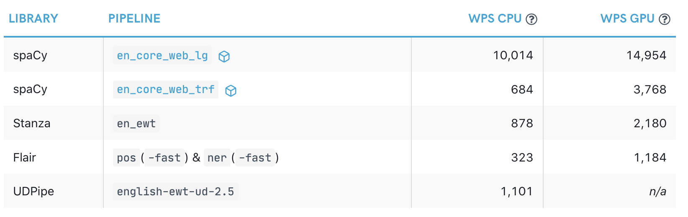

# DaCy and Spacy

by Kenneth Enevoldsen | 2021-05-16

---

# Agenda

- What is SpaCy and why should you care?
  - Speed and multitasking
  - Integration
  - Costomicability
  
- Loading and using DaCy
  - example use
  - Visualizing predictions
  - expanding SpaCy

---

## What is SpaCy

- Production-friendly NLP tools
- Open-source
- More than 64 languages (more if you include extensions)
- Easily extensible

---

## Speed and multitasking

- Multitask by default
- mostly written in Cython
- Efficient data structures
- Avoid copying data
  

---

## Integration

- streamlit
- Weight and Biases
- Tensor frameworks: Tensorflow, mxnet, Torch
- Stanza
- Huggingface transformers

---

## Example
Using DaCy and SpaCy

