# Encoding SNP's using CNNs

by Kenneth Enevoldsen | 2021-05-18

---

## Agenda

- What we did
- Convolutional Neural Networks
- Alternative approaches

---

## Denoising Autoencoder

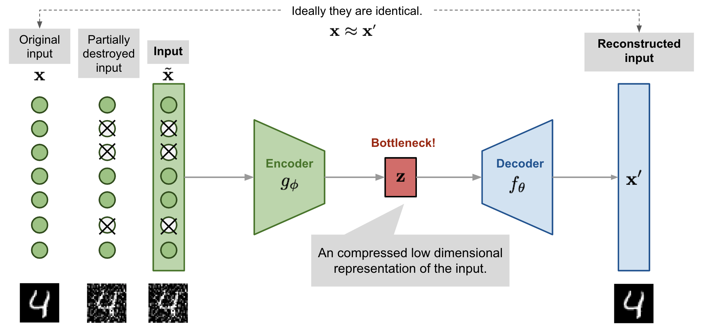

---

## Input data
SNP Encoding:

|  0  |  1  |  2  | NA  |
| --- | --- | --- | --- |
|  0  |  0  |  1  |   1|
|  0  |  1  |  1  |   0|

Example data
|     |     |     |     |     |     |     |     |     |     |     |
| --- | --- | --- | --- | --- | --- | --- | --- | --- |--- | --- |
|  0  |  0  |  0  |  1  |  0  |  0  |  0  |  0  |  0  | 0  |  ...  |
|  0  |  1  |  0  |  1  |  0  |  1  |  0  |  1  |  0  |  1  |  ...  | 
|     |     |     |     |     |     |     |     |     |     |     |

---

## Reconstruction

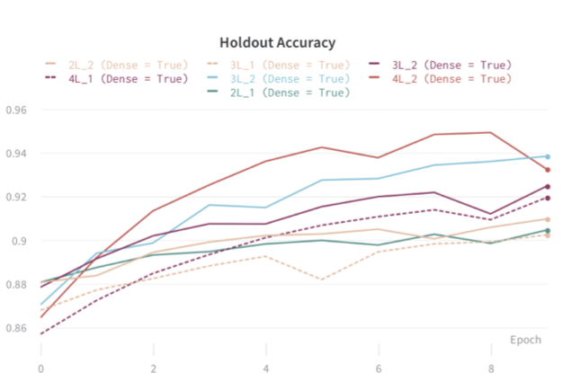

---

## Predicition

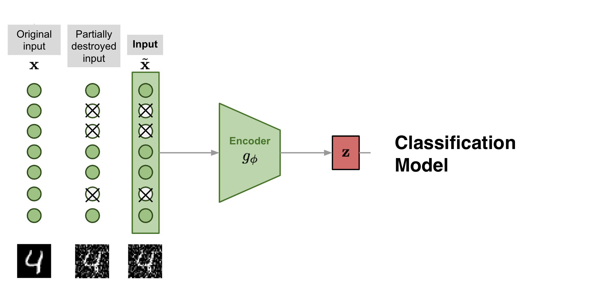

---

## Performance

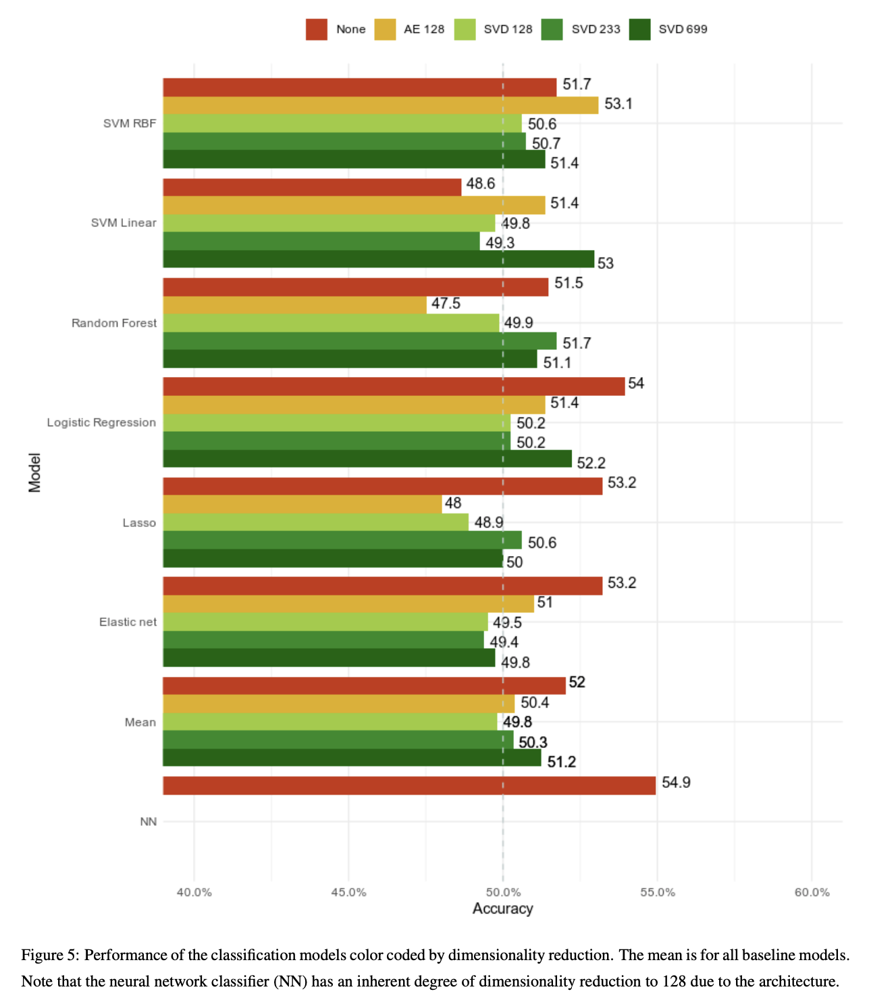

---

## 1D Convolutional

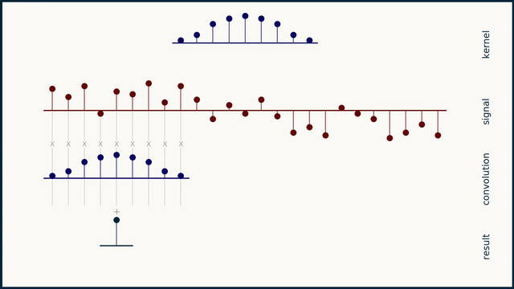

- Reduces number of trainable parameters
- Parallel

---

## Activation function

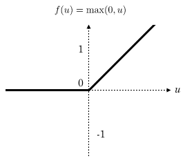

---

## 2D Convolutional

---

## Training

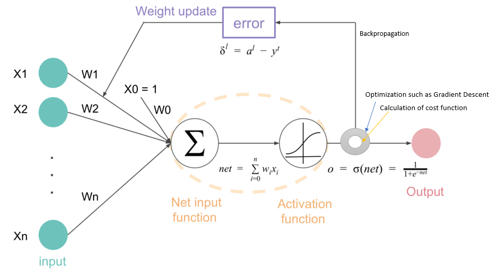

- optimizer: Adam

---

# Alternative Approaches

- Recurrent models
- Positional Encodings
- Attention-based models

---

## Recurrent models

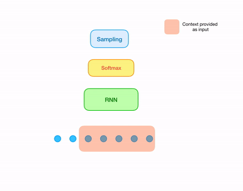

---

## Recurrent Encoding

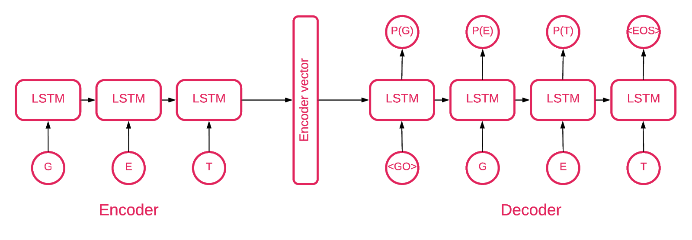

---

### Bidirectional

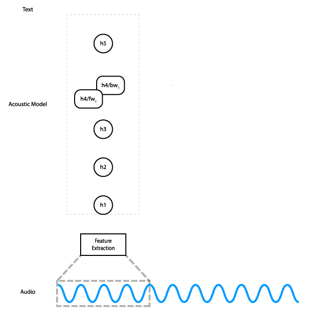

---

### Positional Encoding

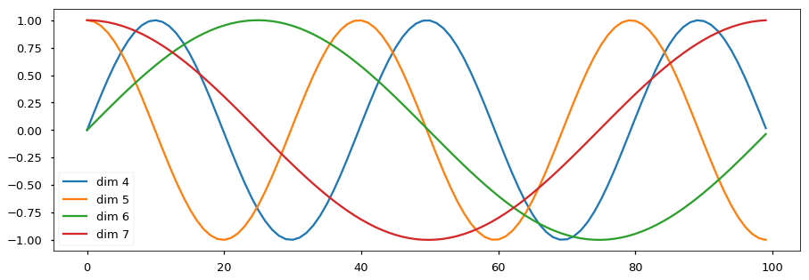

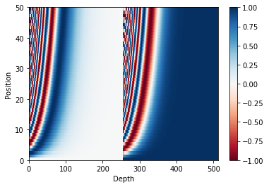

---

### Attention

