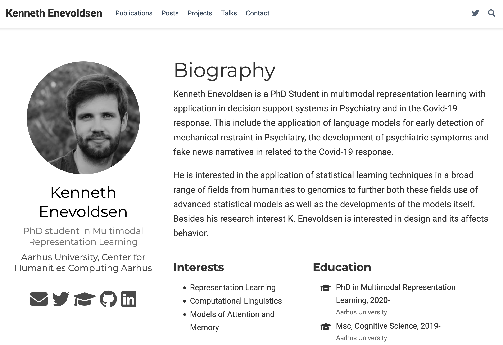

---
authors:
  kennethenevoldsen:
    name: Kenneth Enevoldsen
    description: Creator
    avatar: https://github.com/kennethenevoldsen.png
date: 2025-12-11 
---

# Oh look, a new website!

My previous website had gotten quite stale. It wasn't that I didn't want to update it—it was more that whenever I wanted to, I had to figure out how to get started again.

<figure markdown>

<figcaption>Before: The old site</figcaption>
</figure>

<figure markdown>

<figcaption>After: The new Zensical-powered site</figcaption>
</figure>

I didn't really have a problem with how the old site looked (though I do find the current look better). The issue was the editing. Since I only ever so rarely add things to the website, remembering how I did everything was always a hassle. It's not like my daily routine revolves around website maintenance—well, maybe with the exception of MkDocs, which many of my projects now use for documentation.

So, inspired by a few other projects[^1], I wanted to build my personal site using MkDocs—a tool for building static documentation sites from Markdown files. Admittedly, that's a bit of an odd choice for a personal website. However, while looking into it, I found the developer's new project, [Zensical](https://zensical.org/docs/get-started/)—an absolutely stunning site generator that works perfectly for my use case. It doesn't support all features yet[^2], but it's definitely good enough to get me started.

Anyway, new is new, so I hope you like it. I'll probably tweak things as Zensical adds more features—but for now, this'll do. Cheers!

If you're looking for content from the old site, you might be able to find it [here](https://github.com/KennethEnevoldsen/KennethEnevoldsen.github.io/tree/website-v1).

[^1]: For those interested: [nathancatania](https://github.com/nathancatania/website), [msleigh](https://www.msleigh.io/blog/2023/09/24/using-material-for-mkdocs-for-a-personal-website-and-blog/), and [jdsalaro](https://jdsalaro.com/) (Sphinx-based). There's also a [tutorial on Medium](https://medium.com/@kaliarch/building-a-personal-blog-with-material-for-mkdocs-4d73233f2300).
[^2]: Most notably a proper blog—of course this is a blog post, but as you can see it's located as a menu item.