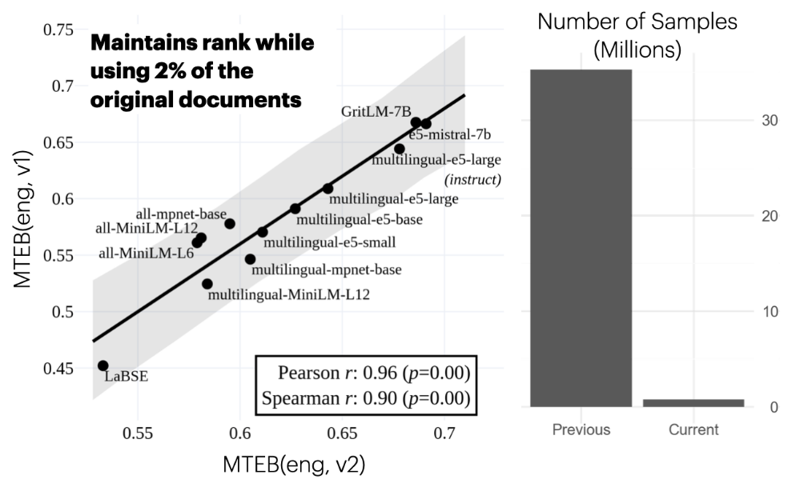
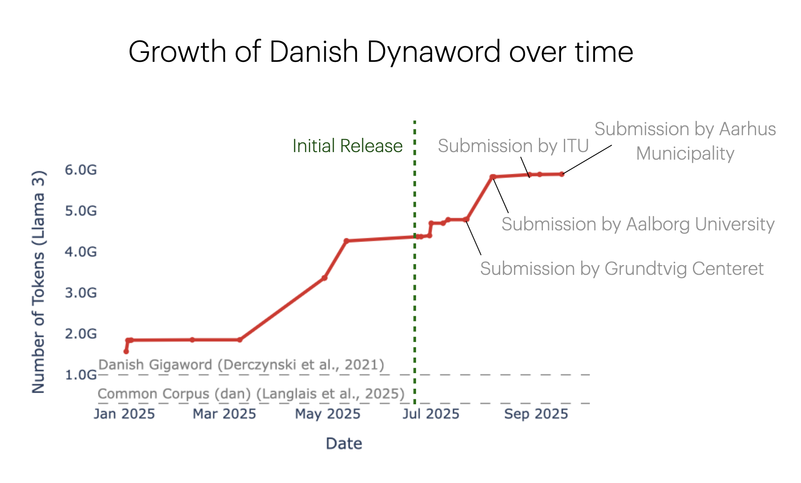

# Publications

A somewhat up to date list of publications. For an alternative view check out my [Google Scholar](https://scholar.google.com/citations?user=VJRMvHUAAAAJ&hl=da&oi=ao).

## Highlights

-   **MMTEB: Massive Multilingual Text Embedding Benchmark**

    { align=right width=300 }

    MMTEB was a large scale community collaboration of more than 50 authors to expands embedding benchmark MTEB to expand the multilingual coverage to more than 250 languages, while significantly reducing inference cost. It is today one of the de-facto bencharks for embeddings.

    ---
    [:lucide-github: Code](https://github.com/embeddings-benchmark/mteb){ .md-button }
    [:lucide-newspaper: Paper](https://openreview.net/forum?id=zl3pfz4VCV){ .md-button }
    [:lucide-notepad-text: Blog](https://huggingface.co/blog/isaacchung/mteb-v2){ .md-button }

-   **Dynaword: From One-shot to Continuously Developed Datasets**

    { align=left width=300 }

    Dynaword is a framework for continously expanding open datasets of training data for large language models. We prove that this framework works by providing an implementation of it, the Danish Dynaword, which have grown by more than 6x in less than a year. 

    ---
    [:lucide-database: Data](https://huggingface.co/datasets/danish-foundation-models/danish-dynaword){ .md-button }
    [:lucide-newspaper: Paper](https://arxiv.org/abs/2508.02271){ .md-button }

-   **Dacy: A Unified Framework for Danish NLP**

    { align=right width=200 }

    DaCy is a unified framework for Danish NLP built still todays (2025) offer state-of-the-art performance for Danish Named entity recognition, dependency parsing, parts-of-speech tagging and more.

    ---
    [:lucide-github: Code](https://github.com/centre-for-humanities-computing/DaCy/){ .md-button }
    [:lucide-newspaper: Paper](https://ceur-ws.org/Vol-2989/short_paper24.pdf){ .md-button }

## Submitted or to be submitted
- **Enevoldsen, K.**, Jensen, K. N., Kostkan, J., Szabó, B., Kardos, M., Vad, K., Núñez, A. B., Barmina, G., Nielsen, J., Larsen, R., & others. (2025). Dynaword: From one-shot to continuously developed datasets. arXiv Preprint arXiv:2508.02271. — Submitted at LREC

## Peer-reviewed and Accepted

*Sorted by year, but otherwise in no particular order*

- **Enevoldsen, K.**, Chung, I., Mathur, A., Kerboua, I., Kardos, M., Stap, D., Gala, J., Siblini, W., Sturua, S., Utpala, S., Sequeira, G., Schaeffer, M., Ciancone, M., Misra, D., Dhakal, S., Rystrøm, J., Weller, O., Xiao, C., Çag, Ö., … Cassano, F. (2025). MMTEB: Massive Multilingual Text Embedding Benchmark. International Conference on Learning Representations (ICLR).
- Lyngbaek, L., Feldkamp, P., Bizzoni, Y., Nielbo, K., & **Enevoldsen, K.** (2025). Continuous sentiment scores for literary and multilingual contexts. Computational Humanities Research (CHR)
- Kardos, M., **Enevoldsen, K. C.**, Kostkan, J., Kristensen-McLachlan, R. D., & Rocca, R. (2025). Turftopic: Topic modelling with contextual representations from sentence transformers. Journal of Open Source Software, 10(111), 8183.
- Xiao, C., Chung, I., Kerboua, I., Stirling, J., Zhang, X., Kardos, M., Solomatin, R., Moubayed, N. A., **Enevoldsen, K.**, & Muennighoff, N. (2025). MIEB: Massive image embedding benchmark. Proceedings of the IEEE/CVF International Conference on Computer Vision (ICCV).
- Chung, I., Kerboua, I., Kardos, M., Solomatin, R., & **Enevoldsen, K.** (2025). Maintaining MTEB: Towards long term usability and reproducibility of embedding benchmarks. Championing Open-Source Development in ML Workshop @ ICML25. https://openreview.net/forum?id=qcPJs0KRZW
- Kardos, M., **Enevoldsen, K. C.**, & Nielbo, K. L. (2025). Topicwizard – a modern, model-agnostic framework for topic model visualization and interpretation. 8th International Conference on Natural Language.
- Nielsen, D. S., **Enevoldsen, K.**, & Schneider-Kamp, P. (2025). Encoder vs Decoder: Comparative Analysis of Encoder and Decoder Language Models on Multilingual NLU Tasks. Nordic Conference on Computational Linguistics (NoDaLiDa).
- Holur, P., **Enevoldsen, K. C.**, Mboning, L., Georgiou, T., Bouchard, L.-S., Pellegrini, M., & Roychowdhury, V. (2025). Embed-Search-Align: DNA Sequence Alignment using Transformer Models. Bioinformatics.
- Hansen, L., Bernstorff, M., **Enevoldsen, K.**, Kolding, S., Damgaard, J. G., Perfalk, E., Nielbo, K. L., Danielsen, A. A., & Østergaard, S. D. (2025). Predicting Diagnostic Progression to Schizophrenia or Bipolar Disorder via Machine Learning. JAMA Psychiatry. https://jamanetwork.com/journals/jamapsychiatry/article-abstract/2830144
- **Enevoldsen, K.**, Kardos, M., Muennighoff, N., & Nielbo, K. L. (2024). The scandinavian embedding benchmarks: Comprehensive assessment of multilingual and monolingual text embedding. Neurips.
- **Enevoldsen, K.** (2024). Augmenty: A Python Library for Structured Text Augmentation. Journal of Open Source Software, 9(96), 6370. https://doi.org/10.21105/joss.06370
- Bernstorff, M., Vistisen, S. T., & **Enevoldsen, K. C.** (2024). Natural language processing for electronic health records in anaesthesiology: An introduction to clinicians with recommendations and pitfalls. Journal of Clinical Monitoring and Computing, 38(2), 241–245. https://doi.org/10.1007/s10877-024-01128-3
- Lassen, I. M. S., Kristensen-McLachlan, R. D., Almasi, M., **Enevoldsen, K.**, & Nielbo, K. L. (2024). Epistemic consequences of unfair tools. Digital Scholarship in the Humanities, 39(1), 198–214.
- Charquero-Ballester, M., Walter, J. G., Rybner, A. S., Nissen, I. A., **Enevoldsen, K. C.**, & Bechmann, A. (2024). Emotions on Twitter as crisis imprint in high-trust societies: Do ambient affiliations affect emotional expression during the pandemic? Plos One, 19(3), e0296801.
- Kardos, M., Kostkan, J., Vermillet, A.-Q., Nielbo, K., **Enevoldsen, K.**, & Rocca, R. (2024). $S^3$—Semantic Signal Separation (No. arXiv:2406.09556). arXiv. https://doi.org/10.48550/arXiv.2406.09556
- **Enevoldsen, K.**, Jessen, E. T., & Baglini, R. (2024). DANSK and DaCy 2.6.0: Domain Generalization of Danish Named Entity Recognition. The Northern European Journal of Language Technology (NEJLT). https://nejlt.ep.liu.se/article/view/5249
- Feldkamp, P., Lassche, A., Kostkan, J., Kardos, M., **Enevoldsen, K.**, Baunvig, K., & Nielbo, K. (2024). Canonical Status and Literary Influence: A Comparative Study of Danish Novels from the Modern Breakthrough (1870–1900). In M. Hämäläinen, E. Öhman, S. Miyagawa, K. Alnajjar, & Y. Bizzoni (Eds.), Proceedings of the 4th International Conference on Natural Language Processing for Digital Humanities (pp. 140–155). Association for Computational Linguistics. https://doi.org/10.18653/v1/2024.nlp4dh-1.14
- Bernstorff, M., Hansen, L., **Enevoldsen, K.**, Damgaard, J., Hæstrup, F., Perfalk, E., Danielsen, A. A., & Østergaard, S. D. (2024). Development and validation of a machine learning model for prediction of type 2 diabetes in patients with mental illness. Acta Psychiatrica Scandinavica, acps.13687. https://doi.org/10.1111/acps.13687
- Hansen, L., Olsen, L. R., & **Enevoldsen, K.** (2023). TextDescriptives: A Python package for calculating a large variety of metrics from text. Journal of Open Source Software, 8(84), 5153. https://doi.org/10.21105/joss.05153
- Bernstorff, M., **Enevoldsen, K.**, Damgaard, J., Danielsen, A., & Hansen, L. (2023). timeseriesflattener: A Python package for summarizingfeatures from (medical) time series. Journal of Open Source Software, 8(83), 5197. https://doi.org/10.21105/joss.05197
- Lassen, I. M. S., Almasi, M., **Enevoldsen, K.**, & Kristensen-McLachlan, R. D. (2023). Detecting intersectionality in NER models: A data-driven approach. In S. Degaetano-Ortlieb, A. Kazantseva, N. Reiter, & S. Szpakowicz (Eds.), Proceedings of the 7th Joint SIGHUM Workshop on Computational Linguistics for Cultural Heritage, Social Sciences, Humanities and Literature (pp. 116–127). Association for Computational Linguistics. https://doi.org/10.18653/v1/2023.latechclfl-1.13
- Hansen, L., **Enevoldsen, K.**, Bernstorff, M., Perfalk, E., Danielsen, A. A., Nielbo, K. L., & Østergaard, S. D. (2023). Lexical stability of psychiatric clinical notes from electronic health records over a decade. Acta Neuropsychiatrica, 1–11. https://doi.org/10.1017/neu.2023.46
- Kolding, S., Nymann, K., Hansen, I., **Enevoldsen, K.**, & Kristensen-McLachlan, R. (2023). DanSumT5: Automatic Abstractive Summarization for Danish. Proceedings of the 24th Nordic Conference on Computational Linguistics (NoDaLiDa), 248–264. https://aclanthology.org/2023.nodalida-1.25
- Kristensen-McLachlan, R. D., Lassen, I. M. S., **Enevoldsen, K.**, Hansen, L., & Nielbo, K. L. (2022). Accuracy is not all you need. ADHO 2022-Tokyo. https://dh-abstracts.library.virginia.edu/works/11779
- Waade, P. T., **Enevoldsen, K. C.**, Vermillet, A.-Q., Simonsen, A., & Fusaroli, R. (2022). Introducing tomsup: Theory of mind simulations using Python. Behavior Research Methods, 1–35.
- **Enevoldsen, K.**, Hansen, L., & Nielbo, K. L. (2021). DaCy: A unified framework for danish NLP. Ceur Workshop Proceedings, 2989, 206–216.
- **Enevoldsen, K. C.**, Danielsen, A. A., Rohde, C., Jefsen, O. H., Nielbo, K. L., & Østergaard, S. D. (2021). Monitoring of COVID-19 Pandemic-related Psychopathology using Machine Learning. Acta Neuropsychiatrica, 1–14.
- Have, I., & **Enevoldsen, K.** (2021). From close listening to distant listening: Developing tools for Speech-Music discrimination of Danish music radio. Digital Humanities Quarterly, 015(1).
- Hansen, L., **Enevoldsen, K. C.**, Bernstorff, M., Nielbo, K. L., Danielsen, A. A., & Østergaard, S. D. (2021). The PSYchiatric clinical outcome prediction (PSYCOP) cohort: Leveraging the potential of electronic health records in the treatment of mental disorders. Acta Neuropsychiatrica, 33(6), 323–330. https://doi.org/10.1017/neu.2021.22
- Nielbo, K. L., Baglini, R. B., Vahlstrup, P. B., **Enevoldsen, K. C.**, Bechmann, A., & Roepstorff, A. (2021, January). News information decoupling: An information signature of catastrophes in legacy news media. https://eadh2020-2021.org/
- Baglini, R. B., Nielbo, K. L., Hæstrup, F., **Enevoldsen, K.**, Vahlstrup, P. B., & Roepstorff, A. (2021, June 2). When no news is bad news: Detection of negative events from news media content. https://2021.dhbenelux.org/
- Baglini, R. B., Hansen, L., **Enevoldsen, K.**, & Nielbo, K. L. (2021). Multilingual Sentiment Normalization for Scandinavian Languages. Scandinavian Studies in Language, 12(1), 50–64.
- **Enevoldsen, K. C.,** & Hansen, L. (2017). Analysing political biases in danish newspapers using sentiment analysis. Journal of Language Works-Sprogvidenskabeligt Studentertidsskrift, 2(2), 87–98.

## Preprints and non-peer-reviewed software

- Rystrøm, J. H., & **Enevoldsen, K. C.** (2024). Exposing Assumptions in AI Benchmarks through Cognitive Modelling (No. arXiv:2409.16849). arXiv. https://doi.org/10.48550/arXiv.2409.16849
- **Enevoldsen, K.**, Hansen, L., Nielsen, D. S., Egebæk, R. A. F., Holm, S. V., Nielsen, M. C., Bernstorff, M., Larsen, R., Jørgensen, P. B., Højmark-Bertelsen, M., Vahlstrup, P. B., Møldrup-Dalum, P., & Nielbo, K. (2023). Danish Foundation Models (No. arXiv:2311.07264). arXiv. https://doi.org/10.48550/arXiv.2311.07264
- **Enevoldsen, K.** (2021). Asent: Fast, flexible and transparent sentiment analysis.