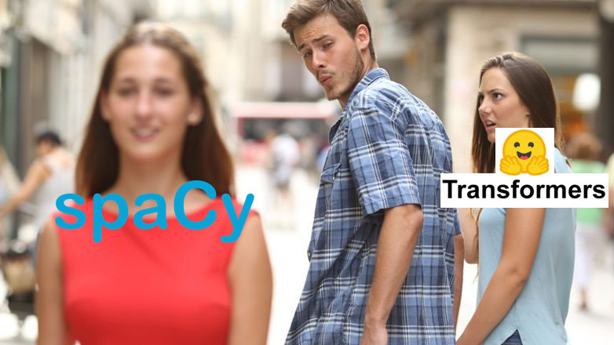

```{r setup, include = FALSE}
library(reticulate)

virtualenv_create(envname = "python_environment", python= "python3")
virtualenv_install("python_environment", packages = c('pandas','numpy'))
use_virtualenv("python_environment", required = TRUE)
```

# About Me

SOME TEXT

# test iframe

<iframe src="https://bookdown.org/yihui/rmarkdown-cookbook/" width="100%" height="600" style="border:1px solid black;">
</iframe>


# testing python code

```{python }
# This is a test code block
x = 3

x <- 5
print(x)
```


## Testing R code


```{r}
# it scrolls
#  This is great
#  This is great


#  This is great


#  This is great


#  This is great


#  This is great

#  This is great
#  This is great


#  This is great


#  This is great


#  This is great


#  This is great

#  This is great
#  This is great


#  This is great


#  This is great


#  This is great


#  This is great

#  This is great
#  This is great


#  This is great


#  This is great


#  This is great


#  This is great
```


## Code highlighting

```{r}
### <b>
x <- 10
y <- x * 2
### </b>

ttt = 2

```

# Bullets

- Eat eggs
- Drink coffee

## Incremental bullets

> - Eat eggs
> - Drink coffee

# Math

$$
\frac{1}{2} + 8 = \alpha
$$

## Math in bullets

- this is a test $\alpha = 2$

# Images 

```{r pressure, echo=FALSE, out.width = '100%'}

```